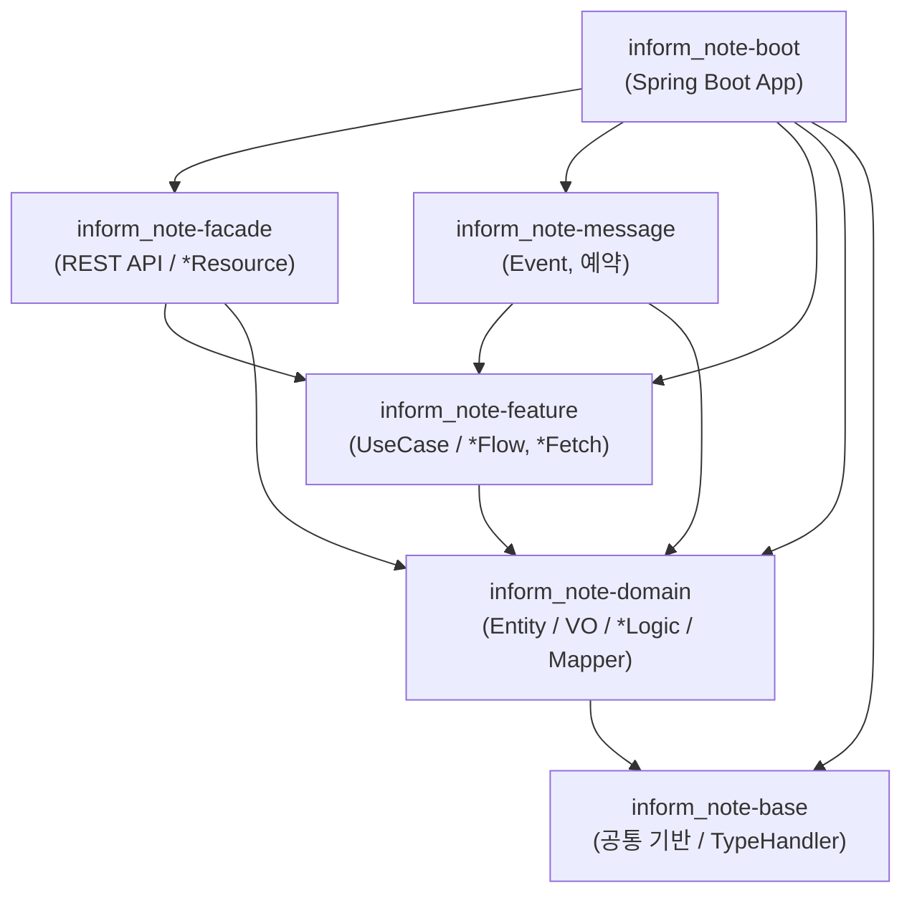

# inform-note (Backend)

설비 비가동(Down Event) 이력 및 **현상·조치 상세(Rich Text/이미지)** 를 관리하는 Spring Boot 백엔드 서비스입니다.
Gradle **멀티 모듈** 구조이며, `inform-note-front` (React) 애플리케이션과 REST API 로 연동됩니다.

- Group / Version: `io.nexcope` / `0.0.1-SNAPSHOT`
- Base Package: `io.nexcope.inform_note`
- API 문서(Swagger UI): `http://localhost:8080/swagger-ui.html`

---

## 1. 기술 스택

`build.gradle` (root + 6개 서브모듈) 및 `application.yaml` 분석 결과입니다.

### 1) 빌드 / 런타임

| 구분 | 항목 | 버전 | 비고 |
|---|---|---|---|
| Language | Java | **21** (Toolchain) | `JavaLanguageVersion.of(21)` |
| Build Tool | Gradle (Multi-Project) | Wrapper (`gradlew`) | `settings.gradle` 6개 모듈 include |
| Framework | Spring Boot | **4.0.7** | `org.springframework.boot` (root 에서 `apply false`) |
| Dependency Mgmt | `io.spring.dependency-management` | `1.1.7` | Spring Boot BOM import |
| Packaging | `bootJar` | - | `inform_note-boot` 만 실행 가능 Jar 생성 |

### 2) 웹 / API

| 라이브러리 | 버전 | 용도 |
|---|---|---|
| `spring-boot-starter-webmvc` | (BOM) | REST Controller (Spring MVC) |
| `springdoc-openapi-starter-webmvc-ui` | `2.8.5` | OpenAPI 3 문서 + Swagger UI |
| `swagger-annotations-jakarta` | `2.2.28` | `@Schema` 등 스키마 어노테이션 (feature 모듈 DTO) |
| `spring-web` | (BOM) | feature 모듈 `MultipartFile` 등 |

### 3) 영속성 (Persistence)

| 라이브러리 | 버전 | 용도 |
|---|---|---|
| `mybatis-spring-boot-starter` | `4.0.1` | MyBatis SQL Mapper (XML 기반) |
| `com.oracle.database.jdbc:ojdbc11` | (BOM) | Oracle JDBC Driver (`runtimeOnly`) |
| `p6spy-spring-boot-starter` | `1.10.0` | SQL / 바인딩 파라미터 로깅 (P6SpyDriver) |

- DB: Oracle — `jdbc:p6spy:oracle:thin:@localhost:1521/FREEPDB1` (스키마 `inform_note`)
- MyBatis 설정: `map-underscore-to-camel-case`, `call-setters-on-nulls`, 커스텀 `AutoEnumTypeHandler` (하이픈/공백 포함 Enum 유연 매핑), JSON 컬럼용 TypeHandler (`io.nexcope.inform_note.base.util.json`)
- Mapper 위치: `classpath*:mapper/**/*.xml`

### 4) 공통 / 유틸

| 라이브러리 | 용도 |
|---|---|
| `jackson-databind`, `jackson-datatype-jsr310` | JSON 직렬화 (`JsonSerializable`, `JsonUtil`), Java 8 Time |
| `org.projectlombok:lombok` | 보일러플레이트 제거 (`@Getter`, `@Builder`, `@Slf4j` 등) |
| `spring-tx` | 선언적 트랜잭션 (`@Transactional`) |
| 자체 구현 `UUIDv7` | 시간순 정렬 가능한 파일 ID(UUID) 생성 |

### 5) 테스트

| 라이브러리 | 용도 |
|---|---|
| `spring-boot-starter-test` | JUnit 5 / AssertJ / Mockito |
| `spring-boot-starter-webmvc-test` | MockMvc 슬라이스 테스트 |
| `mybatis-spring-boot-starter-test` | MyBatis 매퍼 테스트 |

---

## 2. 멀티 모듈 구성

`settings.gradle` 에 6개 모듈이 등록되어 있습니다.

| 모듈 | 역할 | 의존 (module) |
|---|---|---|
| **`inform_note-boot`** | Spring Boot 진입점(`InformNoteApplication`), 전역 설정(OpenAPI/P6Spy), `application.yaml`, `bootJar` 패키징 | facade, message, feature, domain, base 전체 |
| **`inform_note-base`** | 프레임워크 비의존 공통 기반 — `OffsetElementList`(페이징 응답), `CodeName`, `ValueObject`, JSON TypeHandler, `UUIDv7` | (없음) |
| **`inform_note-domain`** | 순수 도메인 — Entity / VO / Enum, 도메인 행위(`*Logic`), MyBatis `*Mapper` + `mapper/*.xml` | base |
| **`inform_note-feature`** | 유즈케이스 서비스 — 도메인 `*Logic` 조합, 트랜잭션 경계(`*Flow` / `*Fetch`), 응답 DTO 조립 | base, domain |
| **`inform_note-facade`** | **API 진입점** — `@RestController` (`*Resource`), 요청 DTO(`*Fetch` / `*Command`), 검증(`validate()`) | base, feature, domain |
| **`inform_note-message`** | (스캐폴딩) 이벤트 Consumer / Producer 예약 모듈 — 현재 구현 클래스 없음 | feature, domain |

### 의존 관계



**요청 처리 흐름**: `*Resource` (facade) → `validate()` → `*Flow` / `*Fetch` (feature) → `*Logic` (domain) → `*Mapper` (MyBatis) → Oracle

---

## 3. 전체 디렉터리 구성도

```text
inform-note/
├── settings.gradle                     # 6개 모듈 include
├── build.gradle                        # allprojects/subprojects 공통 (Java 21, Lombok, Jackson, Spring Boot BOM)
├── gradlew / gradlew.bat
├── doc/                                # 설계 문서, schema_DDL.sql
│
├── inform_note-base/
│   └── src/main/java/io/nexcope/inform_note/base/
│       ├── domain/entity/
│       │   ├── OffsetElementList.java          # offset/limit 페이징 응답 공통 래퍼 <T>
│       │   ├── CodeName.java / CodeNameList.java
│       │   └── ValueObject.java
│       └── util/
│           ├── json/                            # MyBatis <-> JSON 컬럼 매핑
│           │   ├── JsonTypeHandler.java / JsonListTypeHandler.java
│           │   ├── AutoEnumTypeHandler.java     # 하이픈/공백 포함 Enum 유연 매핑
│           │   ├── JsonSerializable.java        # toJson / toPrettyJson 인터페이스
│           │   └── JsonUtil.java
│           └── uuid/UUIDv7.java                 # 시간순 정렬 UUID
│
├── inform_note-domain/
│   ├── src/main/java/io/nexcope/inform_note/domain/
│   │   ├── card/                                # 비가동 이벤트 카드
│   │   │   ├── entity/DownEventCard.java        # 도메인 루트 (+ 비즈니스 메서드)
│   │   │   ├── entity/dto/DownEventCardDto.java
│   │   │   ├── entity/vo/ …                     # FabricationPlant, ProcessModule, EquipmentModel,
│   │   │   │                                    # DownType, WorkStatus, Shift, ReplacementType (enum)
│   │   │   │                                    # AssignedTechnician, Approver, PartReplacement (VO)
│   │   │   │                                    # DownEventCardSearchCriteria (검색조건)
│   │   │   ├── logic/DownEventCardLogic.java
│   │   │   └── mapper/DownEventCardMapper.java
│   │   ├── content/                             # 현상·조치 HTML 본문 (Oracle CLOB)
│   │   │   ├── entity/DownContent.java  +  dto/DownContentDto.java
│   │   │   ├── logic/DownContentLogic.java
│   │   │   └── mapper/DownContentMapper.java
│   │   ├── employees/                           # 사원 / Technician
│   │   │   ├── entity/Employees.java
│   │   │   ├── entity/vo/{ExtractEmployee, EmployeeSearchCriteria}.java
│   │   │   ├── logic/EmployeesLogic.java
│   │   │   └── mapper/EmployeesMapper.java
│   │   ├── file/                                # 첨부 파일 / 에디터 인라인 이미지
│   │   │   ├── entity/AttachedFile.java  +  dto/AttachedFileDto.java
│   │   │   ├── entity/vo/{FileRefType, FileStatus}.java
│   │   │   ├── logic/AttachedFileLogic.java
│   │   │   └── mapper/AttachedFileMapper.java
│   │   └── jobs/                                # 직무 코드
│   │       ├── entity/Jobs.java  +  logic/JobsLogic.java  +  mapper/JobsMapper.java
│   └── src/main/resources/mapper/
│       ├── DownEventCardMapper.xml / DownContentMapper.xml / EmployeesMapper.xml
│       ├── AttachedFileMapper.xml / JobsMapper.xml
│
├── inform_note-feature/
│   └── src/main/java/io/nexcope/inform_note/feature/
│       ├── maintenance/
│       │   ├── domain/dto/{ActionPopupResponse, DownEventsResponse}.java
│       │   ├── flow/MaintenanceFetch.java       # 조회 유즈케이스 (findDownEvents / findTechnicians / findActionPopup)
│       │   ├── flow/MaintenanceFlow.java        # 변경 유즈케이스 (correctiveAction)
│       │   └── task/MaintenanceUtils.java
│       └── file_handler/
│           ├── domain/dto/{FileViewResponse, TempFileRegisteredResponse}.java
│           ├── flow/FileHandlerFetch.java       # loadViewResource (파일 스트리밍 리소스 로드)
│           ├── flow/FileHandlerFlow.java        # registerTempFile (물리 저장 + TEMP 등록)
│           └── task/FileHandlerUtils.java       # HTML 본문에서 fileId 추출
│
├── inform_note-facade/                          # ★ REST API 진입점
│   └── src/main/java/io/nexcope/inform_note/facade/api/
│       ├── feature/maintenance/
│       │   ├── rest/MaintenanceFetchResource.java   # POST /feature/maintenance/find-*
│       │   ├── rest/MaintenanceFlowResource.java    # POST /feature/maintenance/corrective-action/command
│       │   ├── fetch/{FindDownEventCardsFetch, FindTechniciansFetch, FindActionPopupFetch}.java
│       │   └── command/CorrectiveActionCommand.java
│       ├── feature/file_handler/
│       │   ├── rest/FileHandlerFetchResource.java   # GET  /feature/file-handler/view/{fileId}
│       │   ├── rest/FileHandlerFlowResource.java    # POST /feature/file-handler/register-temp-file/command
│       │   └── command/{RegisterTempFileCommand, SaveFilesCommand}.java
│       └── domain/log/
│           ├── rest/DownEventCardResource.java      # POST /domain/card/register-down-event-card(s)/command
│           └── command/{RegisterDownEventCardCommand, RegisterDownEventCardsCommand}.java
│
├── inform_note-message/                         # (스캐폴딩 — 구현 클래스 없음)
│
└── inform_note-boot/
    └── src/main/
        ├── java/io/nexcope/inform_note/
        │   ├── InformNoteApplication.java
        │   └── config/{OpenApiConfig, P6SpyConfig}.java
        └── resources/{application.yaml, spy.properties}
```

---

## 4. REST API 목록 (`inform_note-facade` / `rest`)

`facade` 모듈 `rest` 패키지의 **`*Resource`** 클래스 5개 · 총 **7개 엔드포인트**입니다.
모든 변경/조회 요청은 `@RequestBody` DTO 이며, Controller 진입 즉시 `dto.validate()` 로 필수값을 검증합니다.
(GET 파일 조회 제외 — 전부 `POST`)

### 4-1. `MaintenanceFetchResource` — 정비/보수 조회

`@Tag("Maintenance")` · `@RequestMapping("/feature/maintenance")`

| # | Method / Path | Summary | Request Body | Response |
|---|---|---|---|---|
| 1 | `POST /feature/maintenance/find-down-event-cards/fetch` | 장비 Down 내역 페이징 조회 | `FindDownEventCardsFetch` `{ criteria: DownEventCardSearchCriteria }` | `OffsetElementList<DownEventCard>` |
| 2 | `POST /feature/maintenance/find-technicians/fetch` | Technician 할당용 사원정보 조회 | `FindTechniciansFetch` `{ criteria: EmployeeSearchCriteria }` | `OffsetElementList<ExtractEmployee>` |
| 3 | `POST /feature/maintenance/find-action-popup/fetch` | 현상·조치 상세 팝업 정보 조회 | `FindActionPopupFetch` `{ downEventId: String }` | `ActionPopupResponse` |

- **1** `criteria` 필수. `DownEventCardSearchCriteria` 는 `page/size` 및 `offset/limit` 양쪽 페이징을 지원(기본 size 20).
- **3** `downEventId` 필수. `DownEventCard` + `DownContent(contentHtml)` 를 병합해 반환.

### 4-2. `MaintenanceFlowResource` — 정비/보수 저장

`@Tag("Maintenance")` · `@RequestMapping("/feature/maintenance")`

| # | Method / Path | Summary | Request Body | Response |
|---|---|---|---|---|
| 4 | `POST /feature/maintenance/corrective-action/command` | 정비 작업(Troubleshooting) 처리 | `CorrectiveActionCommand` `{ downEventId, assignedTechnician, partReplacements[], contentHtml, workStatus }` | `String` (처리된 `downEventId`) |

- 필수: `downEventId`, `assignedTechnician`, `workStatus`.
- `workStatus == ACTION_DONE` 이면 조치완료 처리, 그 외에는 상태 변경. 작업자/교체부품 변경분 반영 → `DownEventCard` 수정 → `DownContent` 등록·수정 → `contentHtml` 내 `fileId` 파싱하여 `AttachedFile` 저장(TEMP→SAVED).

### 4-3. `FileHandlerFetchResource` — 파일 조회

`@Tag("FileHandler")` · `@RequestMapping("/feature/file-handler")`

| # | Method / Path | Summary | Request | Response |
|---|---|---|---|---|
| 5 | `GET /feature/file-handler/view/{fileId}` | 이미지/파일 인라인 조회 (에디터 `` 용) | `@PathVariable fileId: String` | `ResponseEntity<Resource>` — 바이너리 스트리밍 |

- 응답 헤더: `Content-Type` = 파일 실제 MIME(`image/png` 등), `Content-Disposition: inline`, `Cache-Control: public, max-age=86400`, `X-Content-Type-Options: nosniff`.
- 파일 메타 미존재 또는 물리 파일 부재 시 `404 Not Found`.

### 4-4. `FileHandlerFlowResource` — 파일 저장

`@Tag("FileHandler")` · `@RequestMapping("/feature/file-handler")`

| # | Method / Path | Summary | Request Body | Response |
|---|---|---|---|---|
| 6 | `POST /feature/file-handler/register-temp-file/command` | 에디터 이미지 삽입 즉시 임시 파일 업로드 | `RegisterTempFileCommand` `{ file: MultipartFile, refType: FileRefType=DOWN_ATTACHMENT, assignedTechnician, refId? }` | `ResponseEntity<TempFileRegisteredResponse>` `{ fileId, link }` |

- 필수: `file`, `refType`, `assignedTechnician`.
- `link` = `/feature/file-handler/view/{fileId}` — 프론트 `` 바인딩용. 저장 경로: `file.upload-dir` (`application.yaml`, 기본 `D:/inform-note-workspace/files`). 최초 상태 `FileStatus.TEMP`.

### 4-5. `DownEventCardResource` — 비가동 이벤트 로그 등록

`@Tag("Down Event Log")` · `@RequestMapping("/domain/card")`

| # | Method / Path | Summary | Request Body | Response |
|---|---|---|---|---|
| 7 | `POST /domain/card/register-down-event-card/command` | 비가동 이벤트 로그 단건 등록 | `RegisterDownEventCardCommand` `{ downEventCardDto: DownEventCardDto }` | `String` (생성된 `downEventId`) |
| 8 | `POST /domain/card/register-down-event-cards/command` | 비가동 이벤트 로그 다건 일괄 등록 | `RegisterDownEventCardsCommand` `{ downEventCardDtos: DownEventCardDto[] }` | `List<String>` (생성된 `downEventId` 목록) |

> `/domain/card/*` 는 도메인 `DownEventCardLogic` 을 직접 호출하는 데이터 적재용 엔드포인트로, 프론트 화면(`/feature/*`)과는 별개입니다.

---

## 5. 주요 DTO / 도메인 타입

### 공통 페이징 응답 — `OffsetElementList<T>` (`inform_note-base`)

```jsonc
{
  "results": [ /* T[] */ ],
  "totalCount": 137,
  "offset": 0, "limit": 20,
  "page": 1, "size": 20, "totalPages": 7,
  "hasNext": true, "hasPrevious": false
}
```

### 검색 조건

| 타입 | 필드 |
|---|---|
| `DownEventCardSearchCriteria` | `fabricationPlant`, `processModule`, `equipmentModel`, `equipmentId`, `keyword`, `isCritical`, `downType`, `workStatus`, `shift`, `technician`, `downStartDatetimeFrom/To`(epoch ms), `sortBy`, `sortDirection`, `page/size` 또는 `offset/limit` |
| `EmployeeSearchCriteria` | `namePattern`, `page/size` 또는 `offset/limit` |

### `DownEventCard` / `ActionPopupResponse` 주요 필드

`downEventId`, `equipmentId`, `chamberId`, `fabricationPlant`, `processModule`, `equipmentModel`, `downType`, `workStatus`,
`downStartDatetime` / `downEndDatetime` / `downDurationMinutes` (epoch ms), `isCritical`, `downCode`, `downCodeDescription`, `alarmId`,
`assignedTechnician`(VO), `approver`(VO), `partReplacements`(VO[]), 감사메타(`createdBy/At`, `updatedBy/At`)
— `ActionPopupResponse` 는 여기에 **`contentHtml`** (Froala HTML 본문) 추가.

### Value Object

| VO | 필드 |
|---|---|
| `AssignedTechnician` | `empNo`, `name`, `jobTitle`, `shift` |
| `Approver` | `empNo`, `jobTitle`, `name`, `approvedAt`(epoch) |
| `PartReplacement` | `replacementType`, `partNo`, `partName`, `qty` |
| `ExtractEmployee` | `empNo`, `name`, `departmentId`, `departmentName`, `jobId`, `jobTitle`, `shift` |

### Enum

| Enum | 값 |
|---|---|
| `WorkStatus` | `DOWN_OCCURRED`(발생), `IN_PROGRESS`(조치중), `ACTION_DONE`(조치완료), `VERIFIED`(검증완료), `CLOSED`(종결) |
| `DownType` | `HARDWARE`, `SOFTWARE`, `PROCESS`, `UTILITY`, `OPTICAL`, `CONSUMABLE`, `PREVENTIVE`, `OPERATOR` |
| `Shift` | `A`(08:00~16:30), `B`(16:00~00:30), `C`(00:00~08:30) |
| `ReplacementType` | `REPLACEMENT_PART`, `USE_MATERIAL` |
| `FileRefType` | `DOWN_CONTENT_INLINE`(본문 인라인), `DOWN_ATTACHMENT`(일반 첨부), `ETC` |
| `FileStatus` | `TEMP`(임시), `SAVED`(저장됨), `DELETED`(삭제됨) |

---

## 6. 실행 방법

### 사전 준비

1. **Oracle DB** 기동 (`localhost:1521/FREEPDB1`), 스키마 `inform_note` 생성 후 `doc/schema_DDL.sql` 실행
2. `application.yaml` 의 `spring.datasource.username/password` 및 `file.upload-dir` 확인/수정
3. JDK 21

### 빌드 & 실행

```bash
# 전체 빌드 (테스트 포함)
./gradlew build

# 애플리케이션 실행 (boot 모듈)
./gradlew :inform_note-boot:bootRun

# 실행 가능 Jar 패키징
./gradlew :inform_note-boot:bootJar
java -jar inform_note-boot/build/libs/inform_note-boot-0.0.1-SNAPSHOT.jar
```

### 확인

| 항목 | URL |
|---|---|
| 서버 포트 | `http://localhost:8080` |
| Swagger UI | `http://localhost:8080/swagger-ui.html` |
| OpenAPI JSON | `http://localhost:8080/v3/api-docs` |

- SQL 및 바인딩 파라미터 로그는 **P6Spy** 로 출력됩니다 (`spy.properties`, `application.yaml` 의 `decorator.datasource.p6spy`).

---

## 7. 전역 설정 파일

| 파일 | 역할 |
|---|---|
| `settings.gradle` | 멀티 모듈 6개 등록 |
| `build.gradle` (root) | `allprojects`(group/version/repo), `subprojects`(Java 21 toolchain, Lombok, Jackson, Spring Boot BOM) |
| `inform_note-boot/.../application.yaml` | 서버 포트, Oracle/P6Spy 데이터소스, MyBatis 설정, SpringDoc 경로, `file.upload-dir` |
| `inform_note-boot/.../spy.properties` | P6Spy 로그 포맷 |
| `config/OpenApiConfig.java` | OpenAPI 문서 메타 (`title: Inform Note API`) |
| `config/P6SpyConfig.java` | P6Spy 커스텀 포맷터 |
