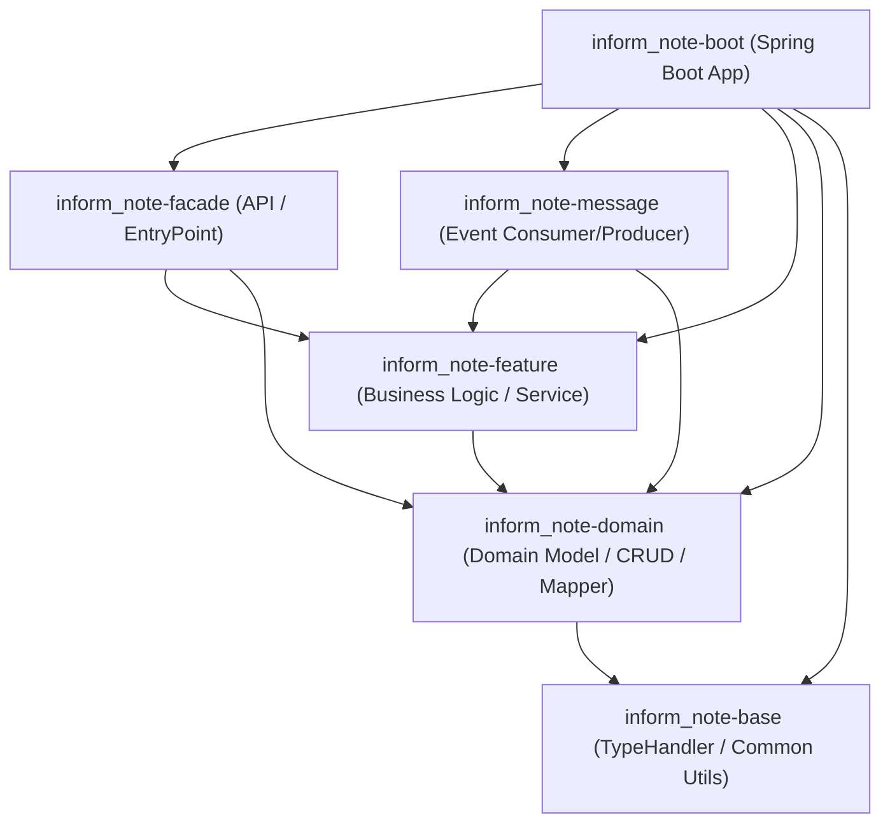

# 멀티 모듈 프로젝트 구성 완료 보고서

요청하신 6개의 멀티 모듈 프로젝트 구조를 생성하고, Gradle 빌드 및 의존성 설정을 완료하였습니다.

## 1. 모듈 구성 요약

| 모듈명 | 설명 및 주요 역할 | 주요 의존성 |
| :--- | :--- | :--- |
| [inform_note-boot](file:///d:/inform-note-workspace/inform-note/inform_note-boot) | Spring Boot Application 진입점 및 패키징(`bootJar`) | `inform_note-facade`, `inform_note-message`, `inform_note-feature`, `inform_note-domain`, `inform_note-base`, Web MVC, MyBatis, Oracle JDBC |
| [inform_note-base](file:///d:/inform-note-workspace/inform-note/inform_note-base) | Jackson 기반 범용 `JsonTypeHandler`, `ListTypeHandler` 등 공통 유틸 | MyBatis, Jackson |
| [inform_note-domain](file:///d:/inform-note-workspace/inform-note/inform_note-domain) | `DownEventLog`, `DownContent`, VO, Enum, 도메인 CRUD, MyBatis Mapper | `inform_note-base`, MyBatis, Oracle JDBC |
| [inform_note-feature](file:///d:/inform-note-workspace/inform-note/inform_note-feature) | 도메인 CRUD 조합 및 복잡한 비즈니스 로직 서비스 | `inform_note-domain`, Spring Starter |
| [inform_note-facade](file:///d:/inform-note-workspace/inform-note/inform_note-facade) | API 엔트리 포인트(Controller/Facade) | `inform_note-feature`, `inform_note-domain`, Web MVC |
| [inform_note-message](file:///d:/inform-note-workspace/inform-note/inform_note-message) | Consumer 이벤트 핸들러, Producer 이벤트 Proxy | `inform_note-feature`, `inform_note-domain`, Spring Starter |

---

## 2. ## 모듈 구성 및 의존 관계

