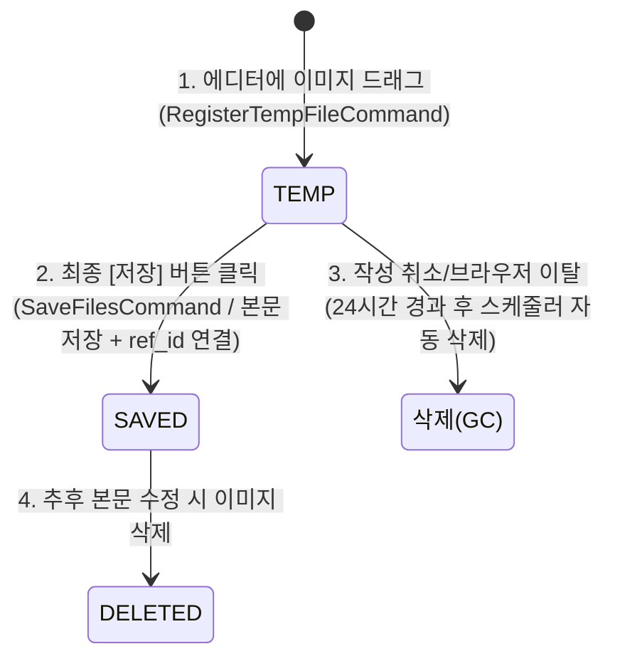
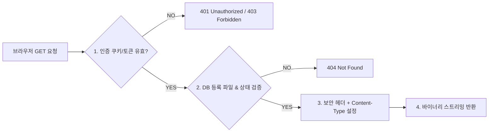
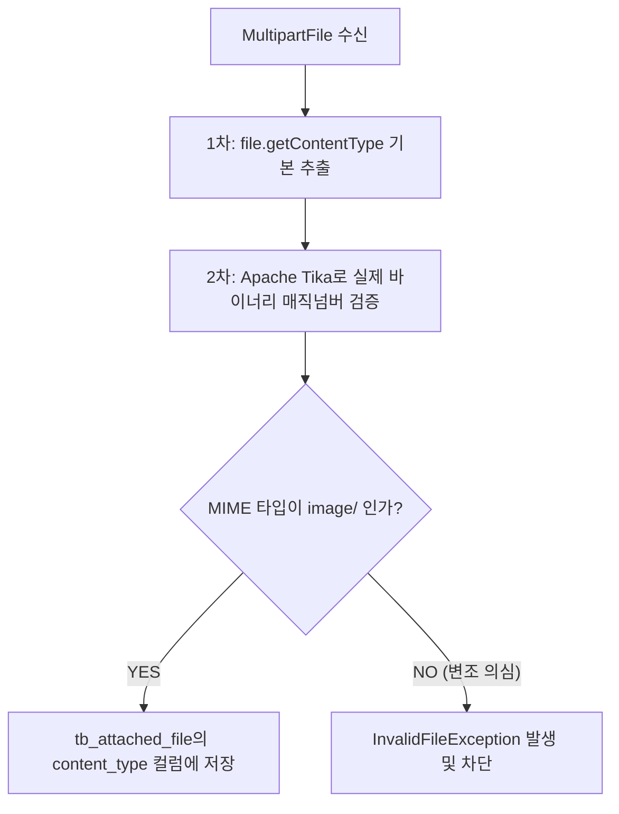
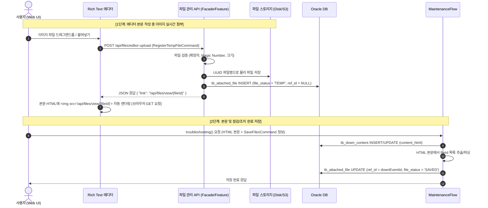

# Rich Text 에디터 이미지 및 첨부파일 저장 아키텍처 구조

## 1. 개요 및 배경
설비 다운 이벤트 점검 및 유지보수 조치 내역을 기록하는 `DownContent`(HTML 본문)는 Froala 등의 Rich Text 에디터를 통해 서식 있는 텍스트, 표, 인라인 이미지, 첨부파일 등을 포함할 수 있습니다.

본 문서는 대용량 이미지와 첨부파일을 안정적이고 효율적으로 저장/관리하기 위한 **2단계 커밋(2-Phase) 파일 라이프사이클 아키텍처, Drag & Drop 즉시 선행 업로드(TEMP) 및 GET 방식 즉시 조회 API 구조와 보안 정책, Command 파라미터 규격, MIME 타입 판별, 다중 이미지 매핑 구조 및 처리 방안**을 종합 정리합니다.

---

## 2. 이미지/첨부파일 처리 방식 비교

| 구분 | Base64 인라인 임베딩 (비권장) | 비동기 선행 업로드 + URL 매핑 (권장) | 본문 저장 시 일괄 Multipart 전송 |
| :--- | :--- | :--- | :--- |
| **처리 방식** | 이미지 바이너리를 Base64로 인코딩하여 HTML ``에 직접 포함 | 에디터에 이미지 삽입 시 즉시 비동기 업로드 API 호출 $\rightarrow$ 저장된 이미지 URL을 반환받아 `src`에 삽입 | 본문 저장 시 HTML과 첨부파일들을 한 번에 `multipart/form-data`로 전송 |
| **장점** | • 구현이 매우 단순함<br>• 별도의 파일 업로드 API 불필요 | • DB CLOB 용량 최소화<br>• 브라우저 HTTP 캐싱 활용 가능<br>• 대용량/다중 이미지에 최적화 | • 본문 저장 시점에만 파일이 저장되므로 유령 파일(Orphan) 발생 없음 |
| **단점** | • 원본 대비 용량 약 33% 증가<br>• DB 성능 저하 및 네트워크 트래픽 급증<br>• 브라우저 렌더링 성능 저하 | • 작성 취소 시 업로드된 임시 파일(Orphan File) 정리 로직 필요 | • 에디터 내 실시간 미리보기 처리가 복잡함<br>• 본문 내 이미지 위치 매핑이 까다로움 |

> **표준 권장 전략**: **에디터 본문 삽입 이미지는 [비동기 선행 업로드]**, **게시글 하단 일반 첨부파일은 [독립된 첨부파일 API 또는 저장 시 파일 ID 매핑]** 방식을 채택합니다.

---

## 3. ★ [핵심 분석] 왜 에디터 Drag & Drop 시 즉시 서버(TEMP)로 선행 업로드하는가?

> [!IMPORTANT]
> **Q. 단순 화면 미리보기용이라면 브라우저 로컬 기능(Blob URL)으로도 가능한데, 왜 Drag & Drop 즉시 서버에 `TEMP`로 선행 저장하는가?**
>
> **A. 단순 UI 렌더링을 넘어, ① 최종 본문 저장 속도 극대화(대용량 트래픽 분산), ② HTML URL 치환 복잡도 제거, ③ 에디터 표준 플러그인 호환성, ④ 자동 임시저장(Draft) 무결성 확보라는 4대 핵심 기술적 가치 때문입니다.**

### 3.1 선행 업로드(TEMP) 적용 vs 미적용 비교 분석

```
[방식 A] 선행 업로드 미적용 (저장 버튼 누를 때 한 번에 파일 전송)
사용자 작성 중 ──────────> [저장 버튼 클릭] ──( 50MB 대용량 일괄 전송 : 5~10초 지연 및 타임아웃 위험! )──> 저장 완료

[방식 B] 선행 업로드 (TEMP) 적용 (드래그 시점마다 백그라운드 분산 전송) ★
이미지 드래그 ─(10MB 백그라운드 업로드)─> 에디터 작성 계속
이미지 드래그 ─(10MB 백그라운드 업로드)─> 에디터 작성 계속
                                         └──> [저장 버튼 클릭] ──( 순수 텍스트 몇 KB만 전송 : 0.1초 즉시 저장! )──> 완료
```

### 3.2 4대 핵심 기술적 타당성

```
+---------------------------------------------------------------------------------------------------------+
|                                  선행 업로드(TEMP)의 4대 핵심 기술 가치                                    |
+------------------------------------+--------------------------------------------------------------------+
| 1. 최종 저장 시 초고속 응답 (0.1초) | 본문 작성 중 백그라운드에서 분산 업로드되므로, 최종 저장 시에는       |
|    - 대용량 네트워크 트래픽 분산   | 무거운 파일 없이 가벼운 텍스트(HTML)만 전송되어 랙(지연)이 전혀 없음 |
+------------------------------------+--------------------------------------------------------------------+
| 2. 본문 HTML 내 URL 일관성 보장   | 클라이언트 로컬 주소(blob:...)를 최종 저장 시 서버 URL로 하나씩     |
|    - 복잡한 치환/파싱 로직 제거   | 찾아서 바꾸는 취약한 치환 과정 없이, 처음부터 완성된 서버 URL 삽입  |
+------------------------------------+--------------------------------------------------------------------+
| 3. 상용 에디터(Froala 등) 표준 구조| Froala, CKEditor, Quill 등 글로벌 에디터들의 이미지 플러그인이       |
|    - 업계 표준 아키텍처 채택      | "업로드 이벤트 -> 서버 URL 반환 -> img 삽입"을 기본 전제로 동작     |
+------------------------------------+--------------------------------------------------------------------+
| 4. 자동 임시저장 (Auto-Save) 지원  | 1분 주기 자동 임시저장 시에도 이미지가 이미 서버 스토리지에 존재하므로|
|    - 브라우저 새로고침/복구 완벽  | 다른 PC나 세션 복원 시 이미지가 깨지지 않고 온전하게 복구됨         |
+------------------------------------+--------------------------------------------------------------------+
```

---

## 4. 2단계 커밋(2-Phase) 파일 라이프사이클 및 Command 규격



### 4.1 `FileRefType` 기본값 정책
- **기본값 (Default)**: `DOWN_ATTACHMENT` (다운 이벤트 일반 첨부파일)
- **에디터 본문 이미지 삽입 시**: 프론트엔드 에디터 플러그인에서 `refType: "DOWN_CONTENT_INLINE"`을 명시하여 전달

---

### 4.2 `RegisterTempFileCommand` (에디터 이미지 Drag & Drop 시)

에디터에 이미지를 드래그하면 `multipart/form-data`로 호출되며, 파일 바이너리와 업로더 메타데이터를 전달받습니다.

```java
package io.nexcope.inform_note.facade.api.feature.file_handler.command;

import io.nexcope.inform_note.base.util.json.JsonSerializable;
import io.nexcope.inform_note.base.util.json.JsonUtil;
import io.nexcope.inform_note.domain.file.entity.vo.FileRefType;
import lombok.*;
import org.springframework.web.multipart.MultipartFile;

@Getter
@Setter
@AllArgsConstructor
@NoArgsConstructor
@Builder
public class RegisterTempFileCommand implements JsonSerializable {

    // [1] 업로드 파일 바이너리 (필수)
    private MultipartFile file;

    // [2] 파일 업무 구분 (기본값: DOWN_ATTACHMENT, 에디터 이미지 시 DOWN_CONTENT_INLINE 지정)
    @Builder.Default
    private FileRefType refType = FileRefType.DOWN_ATTACHMENT;

    // [3] 업로더 사번/ID
    private String uploaderId;

    // [4] 연관 마스터 ID (신규 작성 시 null, 기존 글 수정 시 downEventId 전달 가능)
    private String refId;

    public void validate() {
        if (file == null || file.isEmpty()) {
            throw new IllegalArgumentException("'file' is required and must not be empty.");
        }
    }

    public static RegisterTempFileCommand fromJson(String json) {
        return JsonUtil.fromJson(json, RegisterTempFileCommand.class);
    }
}
```
- **응답 (Response)**: 에디터 규격에 맞는 JSON 반환 (`{ "link": "/api/files/view/{fileId}" }`)
- **DB 상태**: `INSERT INTO tb_attached_file (file_status = 'TEMP', ref_id = NULL)`

---

### 4.3 `SaveFilesCommand` (최종 본문 HTML 저장 시 파일 확정)

최종 [저장] 버튼 클릭 시, HTML 본문에서 파일 키들을 분석하여 **`SAVED` 상태로 확정하고 `ref_id`를 연결**합니다.

```java
package io.nexcope.inform_note.facade.api.feature.file_handler.command;

import io.nexcope.inform_note.base.util.json.JsonSerializable;
import io.nexcope.inform_note.base.util.json.JsonUtil;
import io.nexcope.inform_note.domain.file.entity.vo.FileRefType;
import lombok.*;
import org.springframework.util.Assert;

import java.util.List;

@Getter
@Setter
@AllArgsConstructor
@NoArgsConstructor
@Builder
public class SaveFilesCommand implements JsonSerializable {

    // [1] 연관 마스터 ID (downEventId - 필수)
    private String refId;

    // [2] 파일 업무 구분 (기본값: DOWN_ATTACHMENT, 에디터 본문 동기화 시 DOWN_CONTENT_INLINE 지정)
    @Builder.Default
    private FileRefType refType = FileRefType.DOWN_ATTACHMENT;

    // [3] 최종 작성/수정된 HTML 본문 (인라인 이미지 자동 파싱 대상)
    private String contentHtml;

    // [4] (선택) 클라이언트에서 명시적으로 전달하는 파일 ID 목록
    private List<String> fileIds;

    // [5] 작업자/수정자 사번/ID
    private String modifierId;

    public void validate() {
        Assert.hasText(refId, "'refId' (downEventId) is required.");
        Assert.hasText(contentHtml, "'contentHtml' is required.");
        Assert.hasText(modifierId, "'modifierId' is required.");
    }

    public static SaveFilesCommand fromJson(String json) {
        return JsonUtil.fromJson(json, SaveFilesCommand.class);
    }
}
```
- **DB 상태**: `UPDATE tb_attached_file SET file_status = 'SAVED', ref_id = #{refId} WHERE file_id IN (...)`
- **삭제 처리**: 기존 본문에는 있었으나 수정된 HTML에서 제거된 이미지는 `file_status = 'DELETED'`로 자동 전이

---

## 5. ★ Rich Text 에디터에 이미지 삽입 (서버 업로드) 즉시 조회 API 호출 원리 및 구조

### 5.1 왜 즉시 조회가 필요한가? (선행 업로드 직후의 조회 메커니즘)

> [!IMPORTANT]
> **핵심 원리**: 사용자가 에디터에 이미지를 Drag & Drop 하면 프론트엔드가 별도의 JavaScript(`fetch`/`axios`)로 다운로드 코드를 직접 실행하는 것이 아닙니다.  
> **"선행 업로드 API 응답(`link`)을 에디터 본문의 ``에 주입하면, 웹 브라우저 렌더링 엔진이 자체적으로 백엔드 조회 API를 호출하여 즉시 화면에 렌더링"**합니다.

```
[1. 이미지 드래그] ──> [2. POST /api/files/editor-upload] ──> [3. { "link": "/api/files/view/uuid-1234" } 반환]
                                                                        │
                                                                        ▼
[5. 화면에 이미지 표시] <── [4. GET /api/files/view/uuid-1234 자동 요청] <── [에디터 본문  주입]
```

1. **로컬 가상 메모리(Blob) 의존성 제거**: 브라우저 메모리에만 상주하는 `blob:...` 주소를 쓰지 않고, 업로드 완료 즉시 서버의 정식 리소스 주소로 매핑하여 일관성을 확보합니다.
2. **실시간 작성 화면과 저장 상태의 100% 일치(WYSIWYG)**: 작성자가 보고 있는 이미지가 이미 서버 스토리지에 안정적으로 업로드되어 서비스 가능한 상태임을 즉시 보증합니다.
3. **자동 임시저장(Auto-Save) 및 새로고침 복구**: 작성 도중 예기치 않게 브라우저를 새로고침하거나 자동 저장본을 불러와도 서버 조회 주소를 통해 이미지가 깨지지 않고 온전히 복구됩니다.

---

### 5.2 왜 `POST`가 아닌 `GET` 방식 API여야 하는가?

이미지 조회 API는 반드시 **`GET` 메서드**로 설계되어야 합니다. `POST` 방식 조회를 적용할 경우 다음과 같은 치명적 결함이 발생합니다.

```
+---------------------------------------------------------------------------------------------------------+
|                                    GET 방식 채택의 4대 기술적 필연성                                     |
+------------------------------------+--------------------------------------------------------------------+
| 1. HTML 표준 스펙 제약             | 브라우저의  태그는 엔진 레벨에서 오직 HTTP GET      |
|    -  태그는 GET만 지원       | 요청만 전송하도록 고정되어 있음 (POST 요청 불가)                   |
+------------------------------------+--------------------------------------------------------------------+
| 2. 브라우저 HTTP 캐싱 극대화       | GET 요청은 ETag / Cache-Control을 통해 로컬 디스크/메모리에         |
|    - 서버 부하 & 트래픽 90% 절감   | 자동 캐싱됨. (POST는 스펙상 캐싱 불가로 매번 대용량 재다운로드 발생) |
+------------------------------------+--------------------------------------------------------------------+
| 3. 본문 저장 및 조회 무결성 보장   | HTML 본문에 완성된 GET URL이 저장되므로, 추후 조회 시 추가 스크립트|
|    - 복잡한 바이너리 치환 제거     | 처리 없이 HTML 렌더링만으로 즉시 표시 가능                         |
+------------------------------------+--------------------------------------------------------------------+
| 4. RESTful 멱등성(Idempotent) 준수 | 단순 리소스 조회(Read)는 서버의 상태를 변경하지 않으므로 GET 규약 사용|
+------------------------------------+--------------------------------------------------------------------+
```

* **만약 `POST`로 이미지 조회를 구현할 경우 발생하는 문제**:
  * `` 태그를 사용할 수 없으므로, JavaScript로 매번 POST 요청 $\rightarrow$ 바이너리 Blob 수신 $\rightarrow$ `URL.createObjectURL(blob)` 생성 $\rightarrow$ 태그에 치환하는 극심한 프론트엔드 오버헤드가 발생합니다.
  * 게시글을 열람할 때마다 수십 MB의 이미지를 매번 네트워크를 통해 새로 받아오므로 사내망 트래픽 폭증 및 서버 OOM 위험을 초래합니다.

---

### 5.3 백엔드 및 프론트엔드 예시 코드

#### 1) 백엔드 파일 스트리밍 조회 엔드포인트 (`FileResource.java`)

```java
package io.nexcope.inform_note.facade.api.feature.file_handler.rest;

import io.nexcope.inform_note.domain.file.entity.dto.AttachedFileDto;
import io.nexcope.inform_note.feature.file.service.FileStorageService;
import lombok.RequiredArgsConstructor;
import org.springframework.core.io.Resource;
import org.springframework.http.*;
import org.springframework.web.bind.annotation.*;

import java.nio.charset.StandardCharsets;

@RestController
@RequestMapping("/api/files")
@RequiredArgsConstructor
public class FileResource {

    private final FileStorageService fileStorageService;

    /**
     * 이미지/파일 인라인 조회 (브라우저  태그 및 미리보기용 GET API)
     */
    @GetMapping("/view/{fileId}")
    public ResponseEntity<Resource> viewFile(@PathVariable("fileId") String fileId) {
        // [1] DB에서 파일 메타데이터 조회 (저장 경로, MIME 타입, 원본 파일명 등)
        AttachedFileDto fileDto = fileStorageService.getFileMetadata(fileId);

        // [2] 실제 스토리지(디스크/S3)에서 물리 바이너리 Resource 로드
        Resource resource = fileStorageService.loadFileAsResource(fileDto.getFilePath());

        // [3] 파일명 인코딩 (Content-Disposition용)
        String encodedFilename = ContentDisposition.inline()
                .filename(fileDto.getOriginFileName(), StandardCharsets.UTF_8)
                .build()
                .toString();

        // [4] HTTP 200 OK + 브라우저 렌더링 헤더 반환
        return ResponseEntity.ok()
                // 브라우저 렌더링을 위한 MIME 타입 지정 (image/png, image/jpeg 등)
                .contentType(MediaType.parseMediaType(fileDto.getContentType()))
                // 다운로드가 아닌 화면 출력을 위한 inline 지정
                .header(HttpHeaders.CONTENT_DISPOSITION, encodedFilename)
                // 브라우저 캐싱 적용 (1일간 캐시 유지하여 중복 서버 호출 방지)
                .header(HttpHeaders.CACHE_CONTROL, "public, max-age=86400, must-revalidate")
                // 브라우저 MIME-Sniffing 차단 보안 헤더
                .header("X-Content-Type-Options", "nosniff")
                .body(resource);
    }
}
```

#### 2) 프론트엔드 Rich Text 에디터 연동 예시 (Froala / Toast UI / Quill 공통 개념)

```javascript
// Froala Editor 이미지 비동기 업로드 설정 예시
new FroalaEditor('#editor', {
  // 에디터에 이미지 드래그&드롭/붙여넣기 시 호출할 업로드 API
  imageUploadURL: '/api/files/editor-upload',
  imageUploadMethod: 'POST',
  imageUploadParams: {
    refType: 'DOWN_CONTENT_INLINE'
  },
  events: {
    // 업로드 성공 시 서버 응답({ "link": "/api/files/view/{fileId}" })을 받아
    // 에디터 내부 본문에  태그를 자동으로 생성/교체함
    'image.uploaded': function (response) {
      console.log('이미지 선행 업로드 및 조회 URL 매핑 완료:', response);
    },
    'image.error': function (error, response) {
      alert('이미지 업로드 실패: ' + error.message);
    }
  }
});
```

---

### 5.4 보안 적용 및 안전한 파일 스트리밍 방안

`GET` 방식의 조회 엔드포인트는 외부에 노출될 수 있으므로, 인가되지 않은 접근 및 악성 파일 실행을 방지하기 위해 다음과 같은 보안 체계를 적용합니다.



1. **인증 및 접근 제어 (Authentication & Authorization)**:
   * **HttpOnly 인증 쿠키 (Cookie-based Auth)**: 브라우저는 ``의 `GET` 요청 시에도 동일 도메인의 세션 쿠키 또는 `HttpOnly` JWT 쿠키를 헤더에 자동으로 실어 보냅니다. Spring Security 필터를 통해 로그인된 사용자만 조회를 허용합니다.
   * **단기 서명 토큰 (Pre-signed Token)**: 외부 연동이나 엄격한 보안이 필요한 경우, 업로드 시 1회용 단기 만료 토큰을 발급하여 쿼리 스트링으로 검증합니다 (`/api/files/view/{fileId}?token=eyJhbG...`).
2. **MIME 스니핑(MIME Sniffing) 방지 (`X-Content-Type-Options: nosniff`)**:
   * 브라우저가 파일 확장자나 바이너리를 임의로 판단하여 HTML이나 스크립트로 실행하지 못하도록 `X-Content-Type-Options: nosniff` 헤더를 반드시 설정합니다.
3. **경로 순회(Path Traversal) 차단**:
   * URL 파라미터로 넘어오는 `fileId`는 난수화된 `UUID` 형식만을 허용하며, `../`나 절대경로가 포함될 수 없도록 검증합니다.
   * 실제 파일 경로는 클라이언트 입력값이 아닌 DB에 등록된 `file_path` 컬럼을 통해서만 접근합니다.
4. **SVG 및 실행 스크립트 격리 (XSS 방어)**:
   * 이미지 내에 `<script>` 태그가 삽입될 수 있는 `image/svg+xml` 파일의 경우, 필요 시 `Content-Security-Policy: default-src 'none'` 헤더를 추가하거나 PNG/WebP로 변환하여 서빙합니다.

---

### 5.5 ★ [핵심 분석] 본문 조회 시 `List<Resource>` 일괄 반환 API가 불필요한 이유 및 렌더링 원리

> [!IMPORTANT]
> **Q. 게시글(조치 내역) 조회 시 `downEventId`나 `contentHtml`을 넘겨 `AttachedFile` 목록과 함께 `List<Resource>`(이미지 파일 바이너리들)를 한 번에 반환하는 API가 필요한가?**
>
> **A. 본문 HTML 렌더링 목적이라면 전혀 불필요하며, 단일 `GET /view/{fileId}` 스트리밍 API와 브라우저 자체 렌더링 파이프라인만으로 100% 완벽하게 동작합니다.**

#### 1) 브라우저의 독립적 비동기 병렬 요청 메커니즘
* 프론트엔드가 게시글 조회 API를 통해 `contentHtml` 문자열을 받아 DOM에 렌더링(`v-html` 또는 `innerHTML`)하면,
* 브라우저 렌더링 엔진은 HTML 본문 속의 ``, `` 태그들을 발견하는 즉시 **각각의 `src` 주소로 독립적인 HTTP GET 요청을 병렬 전송**하여 이미지를 화면에 그립니다.
* 따라서 백엔드가 여러 이미지를 억지로 한 번에 묶어서 반환할 필요가 없으며, 단일 스트리밍 엔드포인트(`GET /view/{fileId}`)만 있으면 본문에 이미지가 몇 개가 있든 브라우저가 알아서 완벽히 렌더링합니다.

```
[게시글 조회 응답] ──> contentHtml 렌더링 (innerHTML / v-html)
                           │
                           ├──(1) GET /feature/file-handler/view/uuid-1111 ──(병렬 요청)──> 1번 이미지 표시
                           ├──(2) GET /feature/file-handler/view/uuid-2222 ──(병렬 요청)──> 2번 이미지 표시
                           └──(3) GET /feature/file-handler/view/uuid-3333 ──(병렬 요청)──> 3번 이미지 표시
```

#### 2) HTTP 스트리밍 사양의 한계
* 하나의 HTTP 응답 스트림은 원칙적으로 단일 파일 바이너리(`Resource`)를 전송합니다. 여러 이미지 바이너리(`List<Resource>`)를 하나의 응답에 묶어 보내면 브라우저의 `` 태그가 이를 해석할 수 없습니다.

#### 3) `downEventId` 기반 파일 조회가 필요한 실제 케이스

| 사용 목적 | API 필요 형태 | 반환 타입 | 설명 |
| :--- | :--- | :--- | :--- |
| **본문 인라인 이미지 렌더링** | `GET /view/{fileId}` | `ResponseEntity<Resource>` | ``에 의해 브라우저가 개별 GET 호출 (다건 일괄 API 불필요) |
| **게시글 하단 일반 첨부파일 목록 표시** | `GET /files?refId={downEventId}` | `List<AttachedFileDto>` | 본문 하단에 `[첨부파일: 매뉴얼.pdf (2MB), 점검표.xlsx]` 목록 UI 렌더링용 (메타데이터 조회) |
| **첨부파일 전체 ZIP 일괄 다운로드** | `GET /download/all?refId={downEventId}` | `ResponseEntity<Resource>` (zip) | 다운 이벤트에 연결된 모든 파일을 zip으로 압축하여 일괄 다운로드할 때 |

---

## 6. 이미지 데이터 발생 시 `content_type` 생성 및 검증 원리

업로드된 이미지의 MIME 타입(`content_type`, 예: `image/png`, `image/jpeg`, `image/webp`)을 판별하는 방식은 다음과 같습니다.



1. **클라이언트 헤더 추출 (`MultipartFile.getContentType()`)**: 브라우저가 전송한 MIME 타입을 1차 확인합니다.
2. **바이너리 매직 넘버(Magic Number) 분석 (보안 핵심)**:
   - 파일 확장자 위변조(예: `.exe` 파일을 `.png`로 변조)를 방지하기 위해 파일 바이너리의 첫 바이트(시그니처)를 분석합니다.
   - **PNG**: `89 50 4E 47 0D 0A 1A 0A`
   - **JPEG**: `FF D8 FF`
   - **GIF**: `47 49 46 38`
   - **WEBP**: `52 49 46 46 ... 57 45 42 50`
   - 실무에서는 **Apache Tika** 라이브러리(`tika.detect(inputStream)`)를 사용하여 안전하게 판별합니다.
3. **DB 저장**: 최종 판별된 `content_type` 문자열(예: `image/png`)을 `tb_attached_file.content_type` 컬럼에 저장합니다.

---

## 7. 다중 이미지 첨부 시 `ref_id` 및 본문 위치 매핑 구조

### 7.1 `ref_id` 세팅 방식
하나의 HTML 본문 내 여러 위치에 다수의 이미지가 포함되어 있더라도, **해당 이미지들이 속한 부모 데이터의 식별자(PK)인 `down_event_id` 값이 모든 이미지 레코드의 `ref_id`에 동일하게 세팅**됩니다.

#### 데이터 저장 예시 (`down_event_id = "DOWN-20260822-001"` 인 경우)
| file_id (PK) | ref_type | ref_id (부모 ID) | origin_file_name | stored_file_name | file_status |
| :--- | :--- | :--- | :--- | :--- | :--- |
| `uuid-1111-aaaa` | `DOWN_CONTENT_INLINE` | **`DOWN-20260822-001`** | `현상사진1.jpg` | `uuid-1111-aaaa.jpg` | `SAVED` |
| `uuid-2222-bbbb` | `DOWN_CONTENT_INLINE` | **`DOWN-20260822-001`** | `부품교체사진.png` | `uuid-2222-bbbb.png` | `SAVED` |
| `uuid-3333-cccc` | `DOWN_CONTENT_INLINE` | **`DOWN-20260822-001`** | `조치완료화면.png` | `uuid-3333-cccc.png` | `SAVED` |

### 7.2 본문 내 이미지 위치 매핑 원리
각 이미지의 위치 정보는 `tb_attached_file` 테이블이 아니라, **`tb_down_content.content_html` 본문 내부의 태그 순서와 배치**에 의해 자연스럽게 결정됩니다.

```html
<p>1. 챔버 내부 이상 현상 확인</p>
<p></p> <!-- 1번 위치 -->

<p>2. 밸브 부품 신규 교체 작업 진행</p>
<p></p> <!-- 2번 위치 -->

<p>3. 장비 재가동 정상 확인</p>
<p></p> <!-- 3번 위치 -->
```

### 7.3 `ref_id` 통합 매핑의 이점
- **다운 이벤트별 첨부파일 일괄 조회**: `WHERE ref_type = 'DOWN_CONTENT_INLINE' AND ref_id = #{downEventId}` 쿼리로 연관된 모든 이미지를 즉시 추출 가능
- **연쇄 정리(Cascade Delete)**: 다운 이벤트 삭제 시 `ref_id` 조건으로 물리 파일 및 DB 레코드 일괄 정리 가능

---

## 8. 전체 처리 시퀀스 다이어그램



---

## 9. 데이터베이스 설계 (`tb_attached_file`)

```sql
CREATE TABLE IF NOT EXISTS tb_attached_file (
    file_id             VARCHAR2(50)                                    NOT NULL, -- 고유 파일 ID (UUID)
    ref_type            VARCHAR2(30)                                    NOT NULL, -- 참조 도메인 (DOWN_CONTENT_INLINE, DOWN_ATTACHMENT 등)
    ref_id              VARCHAR2(50)                                    NULL,     -- 연관 마스터 ID (down_event_id, 업로드 초기에는 NULL)
    origin_file_name    VARCHAR2(300)                                   NOT NULL, -- 사용자가 올린 원래 파일명
    stored_file_name    VARCHAR2(300)                                   NOT NULL, -- 디스크/S3에 저장된 난수화 파일명 (UUID.ext)
    file_path           VARCHAR2(500)                                   NOT NULL, -- 저장 경로 또는 S3 Object Key
    file_size           NUMBER(19)                                      NOT NULL, -- 파일 크기 (Bytes)
    content_type        VARCHAR2(100)                                   NOT NULL, -- MIME Type (image/png, application/pdf 등)
    file_status         VARCHAR2(20) DEFAULT 'TEMP'                     NOT NULL, -- 상태 (TEMP: 임시, SAVED: 저장됨, DELETED: 삭제됨)
    created_by          VARCHAR2(50),
    created_at          TIMESTAMP WITH TIME ZONE DEFAULT SYSTIMESTAMP   NOT NULL,
    updated_by          VARCHAR2(50),
    updated_at          TIMESTAMP WITH TIME ZONE DEFAULT SYSTIMESTAMP   NOT NULL
);

-- 기본키(PK) 및 인덱스 추가
ALTER TABLE tb_attached_file ADD CONSTRAINT pk_attached_file PRIMARY KEY (file_id);
CREATE INDEX idx_attached_file_ref ON tb_attached_file (ref_type, ref_id);
CREATE INDEX idx_attached_file_status ON tb_attached_file (file_status, created_at);

-- 코멘트 등록
COMMENT ON TABLE tb_attached_file IS '통합 첨부파일 및 에디터 인라인 이미지 메타데이터 테이블';
COMMENT ON COLUMN tb_attached_file.file_id          IS '파일 고유 ID (UUID)';
COMMENT ON COLUMN tb_attached_file.ref_type         IS '연관 업무 구분 (예: DOWN_CONTENT_INLINE, DOWN_ATTACHMENT)';
COMMENT ON COLUMN tb_attached_file.ref_id           IS '연관 마스터 ID (down_event_id)';
COMMENT ON COLUMN tb_attached_file.origin_file_name IS '사용자 업로드 원본 파일명';
COMMENT ON COLUMN tb_attached_file.stored_file_name IS '저장소 저장 난수화 파일명 (UUID.ext)';
COMMENT ON COLUMN tb_attached_file.file_path        IS '저장소 상대/절대 경로 또는 S3 Key';
COMMENT ON COLUMN tb_attached_file.file_size        IS '파일 크기 (Byte 단위)';
COMMENT ON COLUMN tb_attached_file.content_type     IS 'MIME 타입 (image/png 등)';
COMMENT ON COLUMN tb_attached_file.file_status      IS '파일 상태 (TEMP / SAVED / DELETED)';
COMMENT ON COLUMN tb_attached_file.created_by       IS '최초 등록자 사번/ID';
COMMENT ON COLUMN tb_attached_file.created_at       IS '최초 등록 일시';
COMMENT ON COLUMN tb_attached_file.updated_by       IS '최종 수정자 사번/ID';
COMMENT ON COLUMN tb_attached_file.updated_at       IS '최종 수정 일시';
```

---

## 10. 라이프사이클 및 가비지 파일(Orphan File) 관리 전략

### 10.1 유령 파일(Orphan File) 발생 케이스
1. 사용자가 에디터에 이미지를 올렸으나, 저장을 누르지 않고 브라우저를 닫거나 취소한 경우
2. 작성 중 이미지를 삽입했다가 백스페이스나 딜리트로 에디터 상에서 지운 경우
3. 게시글 수정 시 기존에 등록되어 있던 이미지를 삭제하고 저장한 경우

### 10.2 해결 방안
1. **임시 상태 관리 (`TEMP` $\rightarrow$ `SAVED`)**:
   - 업로드 즉시 `file_status = 'TEMP'`로 기록
   - 최종 저장 성공 시에만 해당 파일들의 상태를 `file_status = 'SAVED'`로 변경하고 `ref_id(down_event_id)` 매핑
2. **배치 스케줄러를 통한 주기적 정리 (`@Scheduled`)**:
   - 매일 자정 또는 1시간 주기로 실행
   - `file_status = 'TEMP'`이고 `created_at`이 24시간 이전인 파일 조회
   - 물리 저장소(디스크/S3)에서 파일 삭제 후 DB 레코드 삭제 또는 `DELETED` 처리
3. **수정 시 삭제된 이미지 감지**:
   - 수정 전 HTML에 존재하던 `fileId` 목록과 수정 후 HTML의 `fileId` 목록을 비교
   - 제거된 파일은 `file_status = 'DELETED'` 처리 후 정리 배치에서 삭제

---

## 11. 보안 및 유효성 검증 정책

1. **파일 확장자 화이트리스트 검증**:
   - 허용 이미지: `jpg`, `jpeg`, `png`, `gif`, `webp`, `svg`
   - 허용 일반 첨부파일: `pdf`, `xlsx`, `docx`, `pptx`, `zip`, `txt`, `csv`
   - 실행 파일(`.exe`, `.sh`, `.bat`, `.jsp`, `.asp` 등) 절대 차단
2. **MIME 타입 및 Magic Number(파일 시그니처) 검증**:
   - 확장자 위변조 방지를 위해 Apache Tika 등을 활용하여 바이너리 첫 바이트 시그니처 검증
3. **파일명 난수화 및 경로 순회(Path Traversal) 차단**:
   - 저장 시 `UUID.randomUUID().toString() + "." + ext` 형태로 저장하여 원본 파일명의 특수문자/상위경로 탐색(`../`) 공격 방지
4. **XSS 방지 (HTML Sanitization)**:
   - 클라이언트에서 전달된 HTML을 저장하거나 렌더링하기 전 `Jsoup` 또는 `OWASP Java HTML Sanitizer`를 통해 `<script>`, `onload`, `onerror` 등 악성 스크립트 태그 필터링

---

## 12. 멀티 모듈 기반 구현 구조

```
inform-note/
├── inform_note-base/
│   └── util/file/FileUtil.java (파일 시그니처 검증, 확장자 추출 등)
├── inform_note-domain/
│   ├── src/main/java/.../domain/file/
│   │   ├── entity/AttachedFile.java (엔티티)
│   │   ├── entity/dto/AttachedFileDto.java (DTO)
│   │   ├── entity/vo/FileStatus.java (Enum: TEMP, SAVED, DELETED)
│   │   ├── entity/vo/FileRefType.java (Enum: DOWN_ATTACHMENT[기본], DOWN_CONTENT_INLINE 등)
│   │   ├── mapper/AttachedFileMapper.java (MyBatis 매퍼)
│   │   └── logic/AttachedFileLogic.java (HTML 파일 파싱/조회/동기화 비즈니스 로직)
│   └── src/main/resources/mapper/AttachedFileMapper.xml
├── inform_note-feature/
│   └── src/main/java/.../feature/file/
│       ├── service/FileStorageService.java (물리 디스크/S3 파일 IO)
│       └── scheduler/OrphanFileCleanupScheduler.java (임시 파일 청소 배치)
└── inform_note-facade/
    └── src/main/java/.../facade/api/feature/file_handler/
        ├── command/RegisterTempFileCommand.java (임시 파일 등록 커맨드)
        ├── command/SaveFilesCommand.java (본문 저장 및 파일 확정 커맨드)
        └── rest/FileResource.java (파일 업로드 & 다운로드 API 엔드포인트)
```
