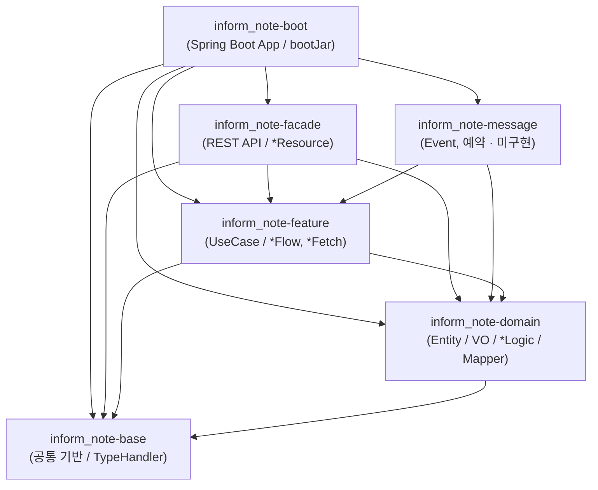

# 멀티 모듈 프로젝트 생성 가이드 (`inform-note`)

본 문서는 `inform-note` 백엔드의 **Gradle 멀티 모듈** 구조, 생성 절차, 모듈별 책임과 의존 관계를 정리합니다.
(실제 `settings.gradle` / `build.gradle` / 소스 트리 기준)

---

## 1. 프로젝트 기본 정보

| 항목 | 값 |
|---|---|
| rootProject | `inform-note` |
| Group | `io.nexcope` |
| Version | `0.0.1-SNAPSHOT` |
| Base Package | `io.nexcope.inform_note` (※ `io.nexcope.inform-note` 는 하이픈 때문에 불가 → 언더스코어 사용, `HELP.md` 참고) |
| Java | **21** (`JavaLanguageVersion.of(21)` toolchain) |
| Spring Boot | **4.0.7** (`org.springframework.boot`) |
| Dependency Mgmt | `io.spring.dependency-management` 1.1.7 |
| Gradle | Wrapper `9.5.1` |
| DB | Oracle (23ai/26ai, `FREEPDB1`) + MyBatis |

---

## 2. 모듈 구성 (`settings.gradle`)

```groovy
rootProject.name = 'inform-note'

include 'inform_note-boot'
include 'inform_note-base'
include 'inform_note-domain'
include 'inform_note-feature'
include 'inform_note-facade'
include 'inform_note-message'
```

| 모듈 | 역할 | 주요 산출물 |
|---|---|---|
| **`inform_note-boot`** | Spring Boot 실행 모듈. 진입점(`InformNoteApplication`), 전역 설정(`OpenApiConfig`, `P6SpyConfig`), `application.yaml`, `spy.properties`. `bootJar` 활성화 / `jar` 비활성화. | 실행 가능 Jar |
| **`inform_note-base`** | 프레임워크 최소 의존 공통 기반. 페이징 응답 래퍼(`OffsetElementList`), `CodeName` / `CodeNameList`, `ValueObject` / `ValueGroup` / `JsonSerializable`, JSON ↔ 객체 유틸(`JsonUtil`), **MyBatis TypeHandler 3종**(`JsonTypeHandler`, `JsonListTypeHandler`, `AutoEnumTypeHandler`), `UUIDv7`. | 공통 라이브러리 |
| **`inform_note-domain`** | 순수 도메인 계층. 도메인별(`card` / `content` / `employees` / `file` / `jobs`) `entity`(+`dto`, `vo`), 도메인 행위·CRUD 조합(`*Logic`), MyBatis `*Mapper` 인터페이스 + `src/main/resources/mapper/*.xml`. | 도메인 라이브러리 |
| **`inform_note-feature`** | 유즈케이스 서비스. 여러 도메인 `*Logic` 을 조합한 트랜잭션 경계(`*Flow` = 변경, `*Fetch` = 조회), 응답 DTO 조립(`ActionPopupResponse`, `TempFileRegisteredResponse` 등), 보조 유틸(`*Utils`). | 서비스 라이브러리 |
| **`inform_note-facade`** | **API 진입점**. `@RestController`(`*Resource`), 요청 DTO(`*Fetch` / `*Command`)와 `validate()` 검증, `feature` 계층 호출. SpringDoc(OpenAPI) 노출. | API 라이브러리 |
| **`inform_note-message`** | (스캐폴딩) 이벤트 Consumer / Producer 예약 모듈. **현재 구현 클래스 없음** — 모듈과 의존성만 존재. | (미구현) |

> [!NOTE]
> 문서 초안에서는 도메인 루트 클래스를 `DownEventLog` 로 표기했으나, **실제 클래스명은 `DownEventCard`** 이고 패키지는 `io.nexcope.inform_note.domain.card.entity` 입니다.
> 단, **DB 테이블명은 `tb_down_event_log`** 로 유지됩니다(레거시 명칭).

---

## 3. 모듈 의존 관계



- **의존 방향(단방향)**: `boot` → `facade`/`message` → `feature` → `domain` → `base`
- **요청 처리 흐름**: `*Resource`(facade) → `dto.validate()` → `*Flow`/`*Fetch`(feature) → `*Logic`(domain) → `*Mapper`(MyBatis) → Oracle

---

## 4. 생성 절차

### Step 1. 루트 프로젝트 및 `settings.gradle`

```groovy
// settings.gradle
rootProject.name = 'inform-note'
include 'inform_note-boot', 'inform_note-base', 'inform_note-domain',
        'inform_note-feature', 'inform_note-facade', 'inform_note-message'
```

### Step 2. 루트 `build.gradle` — `allprojects` / `subprojects` 공통 설정

```groovy
plugins {
    id 'java'
    id 'org.springframework.boot' version '4.0.7' apply false
    id 'io.spring.dependency-management' version '1.1.7' apply false
}

allprojects {
    group = 'io.nexcope'
    version = '0.0.1-SNAPSHOT'
    repositories { mavenCentral() }
}

subprojects {
    apply plugin: 'java'
    apply plugin: 'io.spring.dependency-management'

    dependencyManagement {
        imports {
            mavenBom org.springframework.boot.gradle.plugin.SpringBootPlugin.BOM_COORDINATES
        }
    }

    java {
        toolchain { languageVersion = JavaLanguageVersion.of(21) }
    }

    configurations {
        compileOnly { extendsFrom annotationProcessor }
    }

    dependencies {
        implementation 'org.springframework:spring-tx'
        implementation 'com.fasterxml.jackson.core:jackson-databind'
        implementation 'com.fasterxml.jackson.datatype:jackson-datatype-jsr310'

        compileOnly 'org.projectlombok:lombok'
        annotationProcessor 'org.projectlombok:lombok'
        testCompileOnly 'org.projectlombok:lombok'
        testAnnotationProcessor 'org.projectlombok:lombok'
        testRuntimeOnly 'org.junit.platform:junit-platform-launcher'
    }

    tasks.named('test') { useJUnitPlatform() }
}
```

- `org.springframework.boot` 플러그인은 루트에서 `apply false` 로 두고, **`inform_note-boot` 에서만 적용**합니다.
- Lombok / Jackson / `spring-tx` 는 전 모듈 공통이므로 `subprojects` 에서 일괄 선언합니다.

### Step 3. 각 모듈 `build.gradle`

#### `inform_note-base/build.gradle`
```groovy
dependencies {
    implementation 'org.mybatis.spring.boot:mybatis-spring-boot-starter:4.0.1'
    implementation 'com.fasterxml.jackson.core:jackson-databind'
    testImplementation 'org.springframework.boot:spring-boot-starter-test'
}
```
> MyBatis `BaseTypeHandler` 를 상속하기 위해 mybatis starter 가 필요합니다. Spring Web/컨텍스트 의존은 없습니다.

#### `inform_note-domain/build.gradle`
```groovy
dependencies {
    implementation project(':inform_note-base')
    implementation 'org.mybatis.spring.boot:mybatis-spring-boot-starter:4.0.1'
    runtimeOnly 'com.oracle.database.jdbc:ojdbc11'
    testImplementation 'org.mybatis.spring.boot:mybatis-spring-boot-starter-test:4.0.1'
    testImplementation 'org.springframework.boot:spring-boot-starter-test'
}
```

#### `inform_note-feature/build.gradle`
```groovy
dependencies {
    implementation project(':inform_note-base')
    implementation project(':inform_note-domain')
    implementation 'org.springframework.boot:spring-boot-starter'
    implementation 'org.springframework:spring-web'                       // MultipartFile 등
    implementation 'io.swagger.core.v3:swagger-annotations-jakarta:2.2.28' // 응답 DTO @Schema
    testImplementation 'org.springframework.boot:spring-boot-starter-test'
}
```

#### `inform_note-facade/build.gradle`
```groovy
dependencies {
    implementation project(':inform_note-base')
    implementation project(':inform_note-feature')
    implementation project(':inform_note-domain')
    implementation 'org.springframework.boot:spring-boot-starter-webmvc'
    implementation 'org.springdoc:springdoc-openapi-starter-webmvc-ui:2.8.5'
    testImplementation 'org.springframework.boot:spring-boot-starter-webmvc-test'
    testImplementation 'org.springframework.boot:spring-boot-starter-test'
}
```

#### `inform_note-message/build.gradle`
```groovy
dependencies {
    implementation project(':inform_note-feature')
    implementation project(':inform_note-domain')
    implementation 'org.springframework.boot:spring-boot-starter'
    testImplementation 'org.springframework.boot:spring-boot-starter-test'
}
```

#### `inform_note-boot/build.gradle`
```groovy
plugins {
    id 'org.springframework.boot'
}

dependencies {
    implementation project(':inform_note-facade')
    implementation project(':inform_note-message')
    implementation project(':inform_note-feature')
    implementation project(':inform_note-domain')
    implementation project(':inform_note-base')

    implementation 'org.springframework.boot:spring-boot-starter-webmvc'
    implementation 'org.springdoc:springdoc-openapi-starter-webmvc-ui:2.8.5'
    implementation 'org.mybatis.spring.boot:mybatis-spring-boot-starter:4.0.1'
    implementation 'com.github.gavlyukovskiy:p6spy-spring-boot-starter:1.10.0'
    runtimeOnly 'com.oracle.database.jdbc:ojdbc11'

    testImplementation 'org.springframework.boot:spring-boot-starter-webmvc-test'
    testImplementation 'org.mybatis.spring.boot:mybatis-spring-boot-starter-test:4.0.1'
    testImplementation 'org.springframework.boot:spring-boot-starter-test'
}

bootJar { enabled = true }
jar { enabled = false }   // 라이브러리 Jar(plain jar) 비활성화
```

### Step 4. 실행 모듈 구성 (`inform_note-boot`)

```
inform_note-boot/src/main/
├── java/io/nexcope/inform_note/
│   ├── InformNoteApplication.java      # @SpringBootApplication (MapperScan 미사용 — @Mapper 자동 스캔)
│   └── config/
│       ├── OpenApiConfig.java          # OpenAPI 문서 메타 (title: "Inform Note API")
│       └── P6SpyConfig.java            # P6Spy SQL 포맷터
└── resources/
    ├── application.yaml                # 포트, DataSource(P6Spy), MyBatis, SpringDoc, file.upload-dir
    └── spy.properties                  # P6Spy appender / formatter
```

- `@SpringBootApplication` 의 컴포넌트 스캔 기준 패키지는 `io.nexcope.inform_note` 이며, 모든 하위 모듈이 이 패키지 트리를 공유하므로 `@Service`(도메인 `*Logic`, feature `*Flow/*Fetch`), `@RestController`(facade `*Resource`) 가 자동 등록됩니다.
- MyBatis 매퍼는 각 인터페이스에 `@Mapper` 가 붙어 있어 `mybatis-spring-boot-starter` 가 자동 스캔합니다(별도 `@MapperScan` 불필요).

---

## 5. 전체 소스 트리 (요약)

```text
inform-note/
├── settings.gradle / build.gradle / gradlew
├── doc/                                     # 설계 문서, schema_DDL.sql
├── inform_note-base/  .../base/
│   ├── domain/entity/    OffsetElementList, CodeName, CodeNameList, ValueObject
│   └── util/
│       ├── json/         JsonUtil, JsonSerializable, ValueGroup,
│       │                 JsonTypeHandler, JsonListTypeHandler, AutoEnumTypeHandler
│       └── uuid/          UUIDv7
├── inform_note-domain/  .../domain/
│   ├── card/     entity(DownEventCard) + dto + vo(FabricationPlant, ProcessModule,
│   │             EquipmentModel, DownType, WorkStatus, Shift, ReplacementType,
│   │             AssignedTechnician, Approver, PartReplacement, DownEventCardSearchCriteria)
│   │             + logic(DownEventCardLogic) + mapper(DownEventCardMapper)
│   ├── content/  entity(DownContent) + dto + logic + mapper
│   ├── employees/ entity(Employees) + vo(ExtractEmployee, EmployeeSearchCriteria) + logic + mapper
│   ├── file/      entity(AttachedFile) + dto + vo(FileRefType, FileStatus) + logic + mapper
│   ├── jobs/      entity(Jobs) + logic + mapper
│   └── resources/mapper/  DownEventCardMapper.xml, DownContentMapper.xml,
│                          EmployeesMapper.xml, AttachedFileMapper.xml, JobsMapper.xml
├── inform_note-feature/  .../feature/
│   ├── maintenance/   domain/dto(ActionPopupResponse, DownEventsResponse)
│   │                  + flow(MaintenanceFetch, MaintenanceFlow) + task(MaintenanceUtils)
│   └── file_handler/  domain/dto(FileViewResponse, TempFileRegisteredResponse)
│                      + flow(FileHandlerFetch, FileHandlerFlow) + task(FileHandlerUtils)
├── inform_note-facade/  .../facade/api/
│   ├── feature/maintenance/   rest(MaintenanceFetchResource, MaintenanceFlowResource)
│   │                          + fetch(FindDownEventCardsFetch, FindTechniciansFetch, FindActionPopupFetch)
│   │                          + command(CorrectiveActionCommand)
│   ├── feature/file_handler/  rest(FileHandlerFetchResource, FileHandlerFlowResource)
│   │                          + command(RegisterTempFileCommand, SaveFilesCommand)
│   └── domain/log/            rest(DownEventCardResource)
│                              + command(RegisterDownEventCardCommand, RegisterDownEventCardsCommand)
├── inform_note-message/       (구현 클래스 없음)
└── inform_note-boot/          InformNoteApplication + config + resources
```

---

## 6. 빌드 & 실행

```bash
./gradlew build                          # 전체 빌드 + 테스트
./gradlew :inform_note-boot:bootRun      # 애플리케이션 실행 (8080)
./gradlew :inform_note-boot:bootJar      # 실행 Jar 패키징
```

| 확인 | URL |
|---|---|
| Swagger UI | `http://localhost:8080/swagger-ui.html` |
| OpenAPI JSON | `http://localhost:8080/v3/api-docs` |

---

## 7. 관련 문서

- 도메인 클래스와 MyBatis 연동: [`도메인 클래스와MyBatis연결.md`](./도메인%20클래스와MyBatis연결.md)
- JSON 컬럼 범용 TypeHandler: [`Mybastis Json 컬럼의 json handler 처리.md`](./Mybastis%20Json%20컬럼의%20json%20handler%20처리.md)
- P6Spy SQL 로깅: [`SQL 쿼리와 파라미터 바인딩 값 출력 방법(P6Spy).md`](./SQL%20쿼리와%20파라미터%20바인딩%20값%20출력%20방법(P6Spy).md)
